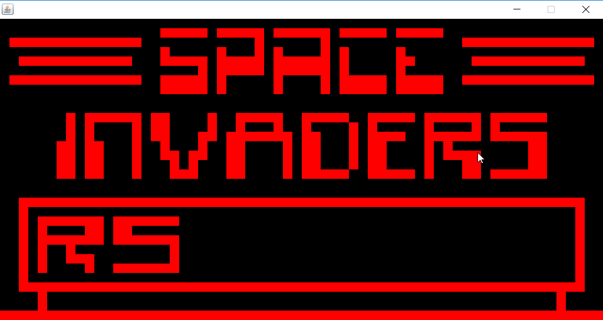

# Bean Chip



A Java Chip8 emulator. Comes with freeware games.

To run, clone the repo onto your computer and execute: 
`mvn compile exec:java -Dexec.mainClass=com.grognak.Main`
(Try typing in "invaders"!)

### Keypad Mapping:
```
   Keypad                   Keyboard
   +-+-+-+-+                +-+-+-+-+
   |1|2|3|C|                |1|2|3|4|
   +-+-+-+-+                +-+-+-+-+
   |4|5|6|D|                |Q|W|E|R|
   +-+-+-+-+       =>       +-+-+-+-+
   |7|8|9|E|                |A|S|D|F|
   +-+-+-+-+                +-+-+-+-+
   |A|0|B|F|                |Z|X|C|V|
   +-+-+-+-+                +-+-+-+-+
```

### References:
* http://www.multigesture.net/articles/how-to-write-an-emulator-chip-8-interpreter/
* http://mattmik.com/files/chip8/mastering/chip8.html
